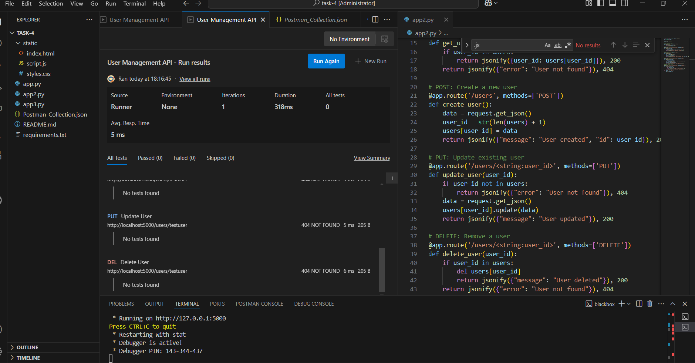

# Flask User Management REST API  

A simple **Flask-based REST API** that allows you to manage user data with basic **CRUD operations** (Create, Read, Update, Delete).  
Data is stored in an **in-memory dictionary** for demonstration purposes.  

## Features  
- **Create** a new user  
- **Read** all users or a specific user by ID  
- **Update** an existing user  
- **Delete** a user  
- **Testable via Postman or cURL**  

## Installation  

 **Install dependencies**  
```bash
pip install flask
```

## Running the API  

```bash
python app2.py
```
The API will be available at:  
```
http://127.0.0.1:5000
```

## API Endpoints  

| Method | Endpoint          | Description                 | Request Body (JSON) Example |
|--------|-------------------|-----------------------------|-----------------------------|
| GET    | `/users`           | Get all users               | -                           |
| GET    | `/users/<id>`      | Get a specific user         | -                           |
| POST   | `/users`           | Create a new user           | `{"name": "John", "email": "john@example.com"}` |
| PUT    | `/users/<id>`      | Update an existing user     | `{"email": "new@example.com"}` |
| DELETE | `/users/<id>`      | Delete a user               | -                           |

## Example Usage (with Postman)



## Example Usage (with cURL)  

**Create a user:**  
```bash
curl -X POST http://127.0.0.1:5000/users \
-H "Content-Type: application/json" \
-d '{"name":"John Doe","email":"john@example.com"}'
```

**Get all users:**  
```bash
curl http://127.0.0.1:5000/users
```

**Update a user:**  
```bash
curl -X PUT http://127.0.0.1:5000/users/1 \
-H "Content-Type: application/json" \
-d '{"name":"John Smith"}'
```

**Delete a user:**  
```bash
curl -X DELETE http://127.0.0.1:5000/users/1
```

## Notes  
- This app uses **in-memory storage**, so all data will reset when the server restarts.
